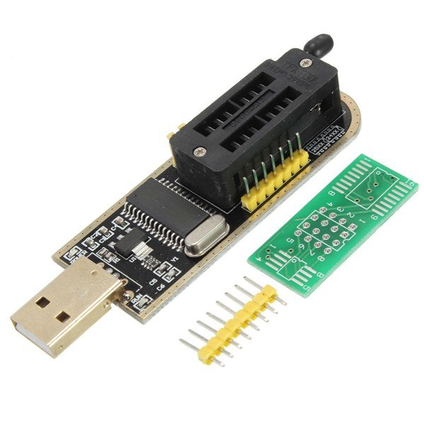
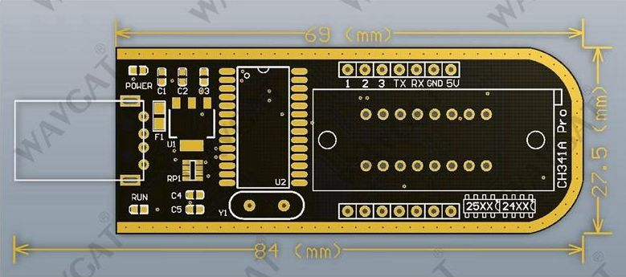
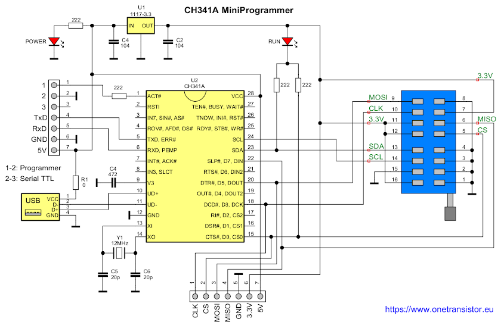
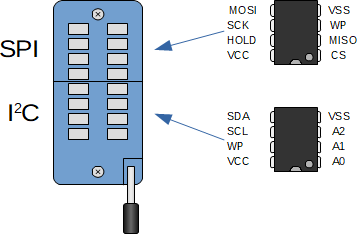
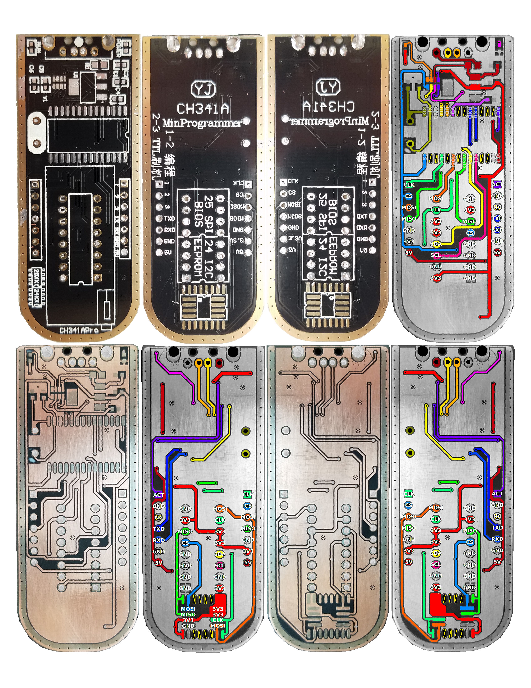

# Correção da tensão de operação do gravador CH341A
O gravador CH341a é dispositivo de baixo valor, na internente pode ser encontrado pelo nome ***CH341A Mini Programmer*, mas muito ultil para gravar memórias flash e i2c.

  

  

  

  

  

# referencias
* https://github.com/stahir/CH341-Store/tree/master
* https://www.onetransistor.eu/2017/08/ch341a-mini-programmer-schematic.html
* https://github.com/Upcycle-Electronics/CH341A-Pro
